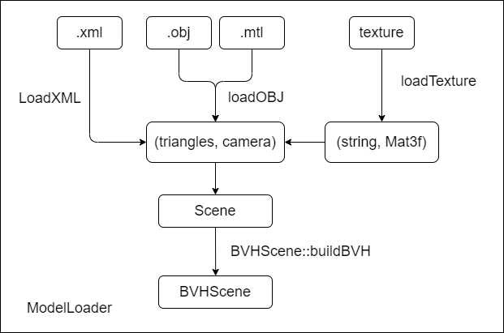
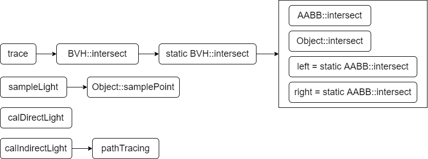
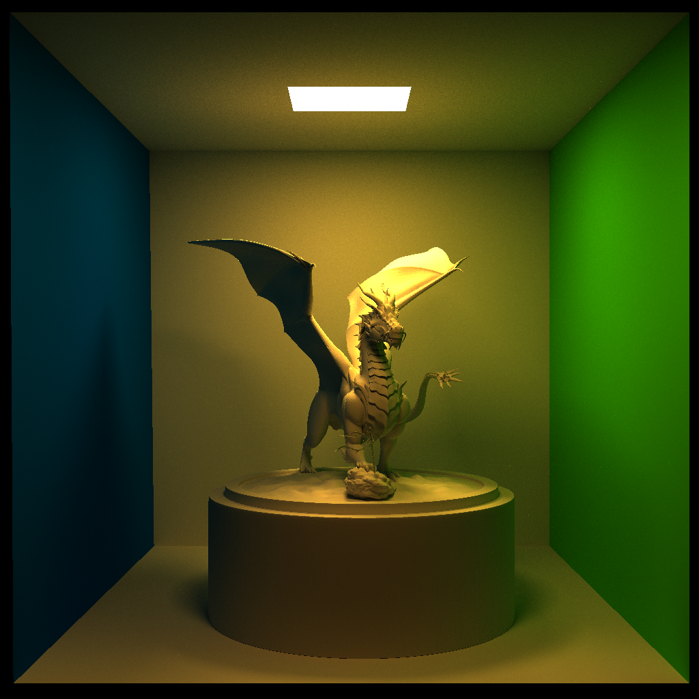
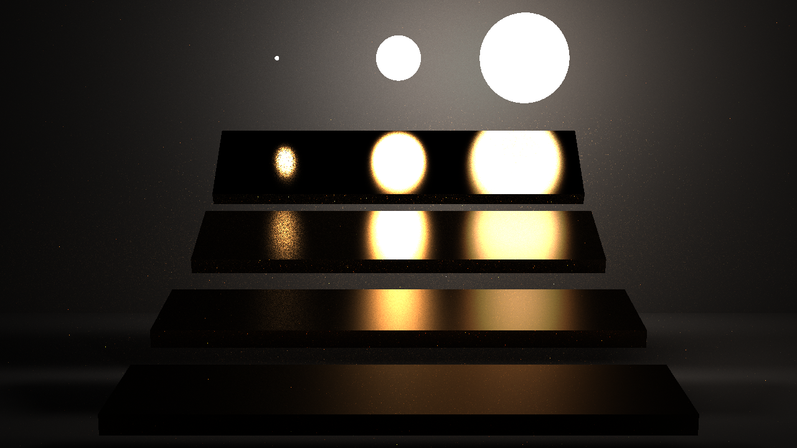
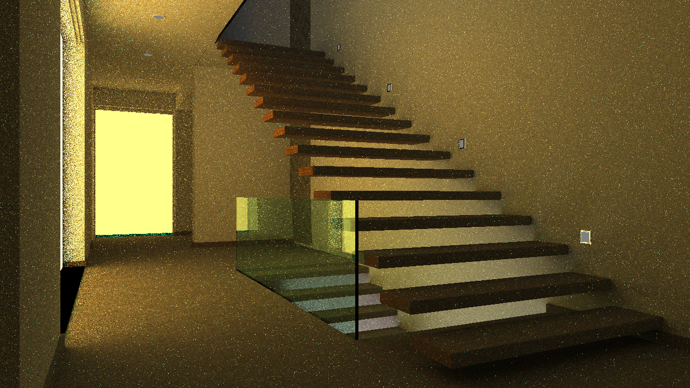
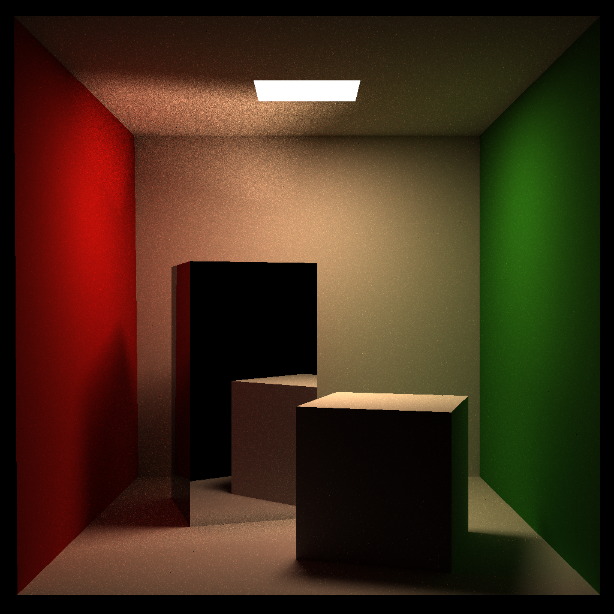

# 路径追踪

# 1 Introduction

实现了CPU模拟的蒙特卡洛路径追踪的渲染器。

参考资料：https://sites.cs.ucsb.edu/~lingqi/teaching/games101.html

依赖库包括加载OBJ和MTL文件的tinyobjloader，解析xml文件的tinyxml2，以及可选的进度条库indicators：
- tinyobjloader：https://github.com/tinyobjloader/tinyobjloader
- tinyxml2：https://github.com/leethomason/tinyxml2
- indicators：https://github.com/p-ranav/indicators

## 1.1 开发环境

- ubuntu 20.04
- cmake version 3.16.3
- gcc version 9.4.0
- opencv-4.x
- gcc openmp

## 1.2 主要目录结构说明

- models：存放模型
- src：存放源码
- tests：存放测试文件
- dependencies：依赖库
- assets：存放渲染结果

## 1.3 运行样例

使用`ModelLoader`，`Scene`和`Renderer`组件，即可方便地进行渲染。渲染结果可保存为检查点`ckpt`，之后可加载并用于增量渲染。

``` cpp
#include "objects/Triangle.h"
#include "objects/ModelLoader.h"
#include "Scene.h"
#include "Renderer.h"

int main()
{
    std::string sceneName = "models/cornellbox-tc/cornell-box.obj";
    std::string ckpt = "output/cornellbox/testCornell-1024.png";

    BVHScene scene = ModelLoader::loadBVHScene(sceneName);
    scene.buildBVH();

    RayTracer renderer(3072, 16);
    cv::Mat3f image = renderer.render(scene, ckpt);
    cv::imwrite("output/cornellbox/testCornell-4096.png", image * 255);

    return 0;
}
```

# 2 Classes

## 2.1 材质类

根据 mtl 文件中各个布林冯光照参数的不同，我们将材质分为以下几类：
- DIFFUSE_AND_GLOSSY：默认漫反射材质，要求无反射与透射参数值
- DIFFUSE_AND_REFLECTION：在漫反射的基础上增加反射项
- DIFFUSE_AND_REFRACTION：在漫反射的基础上增加折射项
- REFLECTION_AND_REFRACTION：同时存在反射与折射
- REFLECTION：完美反射

在路径追踪的实现中，根据BRDF采样出射光线方向的函数仅与材质相关，给定法线与入射方向后即可进行计算，因此将`sampleDir`实现在材质类中。同理，计算某条出射光概率的函数`pdf`也实现在该类。由于各个材质出射方向采样的方案不一样，因此在这两个函数中使用`switch`对每个情况写了采样函数。

## 2.2 物体类和三角形类

三角形类继承自`Object`类，用于加载模型的三角形面片。它实现了几个纯虚的接口，主要函数包括了求交与光线采样。

不论是采用BVH加速求交还是原始的遍历所有物体求交，最后都会调用特定物体的`intersect`函数，在三角形中我们使用重心坐标的方式判断是否相交。如果采用BVH求交，在具体物体求交前应先判断包围盒是否相交，因此物体类中还实现了获取包围盒的方法。

由于担心之后BRDF的计算将会与特定物体的形状相关，我们将BRDF的计算留在了物体类中，在`Object`类中实现为`evalLightBRDF`虚函数，可被子类覆写。

## 2.3 场景类

一个场景包含了模型、光照、材质等各个信息，并提供光线追踪和路径追踪的核心函数。我们实现了两个场景类，父类为`Scene`，子类为`BVHScene`，第二个场景采用了BVH加速结构，在`intersect`求交函数中调用了BVH的求交接口。

### 光线追踪

``` cpp
virtual cv::Vec3f castRay(const cv::Vec3f &eyePos, const cv::Vec3f &dir,  int depth) const;
```

该函数用于光线追踪，向场景中发射一条光线，返回值为看到的颜色。

``` cpp
virtual std::optional<HitPayload> trace(const Ray &ray) const;
```

用于向场景中发射一条光线，返回值为光线首先碰到的物体。由于光线可能未触碰到物体，因此使用`std::optional`封装。`HitPayload`是触碰物体信息的封装结构，在触碰物体为三角形的情况下，直接携带了触碰位置的重心坐标。

### 路径追踪

``` cpp
virtual cv::Vec3f pathTracing(const cv::Vec3f &eyePos, const cv::Vec3f &dir) const;
```

该函数用于路径追踪，与`castRay`类似，但采用蒙特卡洛积分方法获得颜色。在该函数中也引用了光线追踪的`trace`函数。

路径追踪中，将光照效果划分为直接光照与间接光照，直接光照只的是从视点看向物体，能够看到光源直接投射的反射光的颜色部分，间接光照类似于环境光照，采集各个方向上的光线颜色总和，这些颜色通过`pathTracing`函数递归调用实现。

## 2.4 渲染器类

渲染器只提供`render`方法，在子类`PathTracer`中还提供了openmp并行加速的选项，在默认情况下忽略第二个参数，除非指定第二个参数作为推荐的线程数。

当指定检查点图像时，渲染器会根据采样的光线数分配权重，以实现增量渲染。

## 2.5 BVH和AABB加速

为了方便地构造BVH与进行求交运算，我们实现了AABB类，AABB类中的`intersect`方法用于判断一个包围盒是否与某条光线相交。除此以外，我们还重载了+运算符用于多个AABB的合并。

使用递归构建BVH，根据空间中跨度最大的轴划分物体。求交的逻辑中，需要判断场景是否与光线求交。场景由BVH表达，因此将调用BVH的`intersect`函数，而BVH会首先判断是否与节点包围盒相交，这里又调用了AABB的`intersect`函数，如果相交，则判断与哪个子节点相交。最后，如果没有子节点了，就代表光线与当前节点的物体相交，再调用`object`动态绑定的`intersect`函数，完成求交计算的逻辑。

BVH结点结构如下所示，Object只存在于叶子结点，AABB则是当前结点与所有孩子结点的AABB之和。

``` cpp
class BVHNode
{
public:
    std::shared_ptr<Object> obj = nullptr;
    std::shared_ptr<BVHNode> left = nullptr;
    std::shared_ptr<BVHNode> right = nullptr;
    AABB aabb;
};
```

# 3 Implementation

## 3.1 ModelLoader

首先ModelLoader类加载模型。一个完整的模型包含4个部分：
- .xml文件包含了视点和光源信息
- .obj文件包含了模型定义
- .mtl文件包含了材质定义
- texture包含了纹理文件

文件的处理由ModelLoader类完成，类中定义了静态方法用于加载模型，并生成`BVHScene`。



## 3.2 Renderer和Scene的渲染过程

`Renderer`利用`Scene`提供了`pathTracing`方法可以很方便地逐像素渲染，其中`m_spp`代表了每个像素的采样次数，伪代码描述如下：

``` cpp
for (int j = 0; j < height; j++)
{
    for (int i = 0; i < width; i++)
    {
        for (int s = 0; s < m_spp; s++)
        {
            frameBuffer(j, i) += scene.pathTracing(eyePos, dir) / m_spp;
        }
    }
}
```

实现时，加入了openmp并行优化和增量渲染优化，并使用计时器`Timer`类统计渲染时间。

可见，`pathTracing`方法是实现的关键。它分为以下几步：
1. 获取视点发出光线看到的物体
2. 按面积采样场景光源，从光源看向物体
3. 根据看到物体的材质类型和渲染方程得到光照模型，计算像素颜色

光照模型分为直接光与间接光，若从光源看向物体的路径没有被其他物体遮挡，则同时存在直接光和间接光，否则只存在间接光。直接光的计算利用了蒙特卡洛路径积分，间接光的计算相当于把各个方向看到的物体作为一个新的光源，物体颜色作为光源强度，再递归调用`pathTracing`。



## 3.3 纹理

对纹理的不同处理方式可能得到不同的颜色结果，本次对纹理的处理解释为对光线的吸收，即对于纹理(0, 0, 1)，我们解释为完全吸收蓝色光和绿色光，完全反射红色光。这里的颜色格式采用OpenCV默认的BGR格式。除此以外，对纹理坐标的处理采取了先插值再归一化的处理。

总的来说，从吸收和反射光线的角度看，增加纹理实际上是在`pathTracing`得到的颜色上乘上纹理颜色，即
``` cpp
color = pathTracingColor.mul(textureColor);
```

这种处理将导致stairscase中的纹理颜色与环境颜色接近，但随着采样率的提升，仍然可以看出纹理的效果。

# 4 Evaluation

## 4.1 Cornell Box

1024 x 1024 x 512 : 2068142 ms



## 4.2 veachmis



## 4.3 Stairscase



渲染时间记录如下，使用BVH可以提速5到6倍。然而渲染时间仍然太久了，这里只给出spp = 2176的结果。

|spp|4|8|16|32|128|
|-|-|-|-|-|-|
|BVH|104|203|-|843|3065|
|no BVH|-|1172|2098|-|-|

## 4.4 完美反射模型



# 5 Future work

由于计算资源以及ddl原因，我们将以下部分作为未来的改进工作：
1. 增加`stairscase`场景的spp
2. CUDA加速三角形求交运算
3. 增加MSAA抗锯齿

其中第一点和第三点不需要额外新增函数，只需要修改spp以及在伪代码中的增加逐像素随机发射光线进行超采样即可。